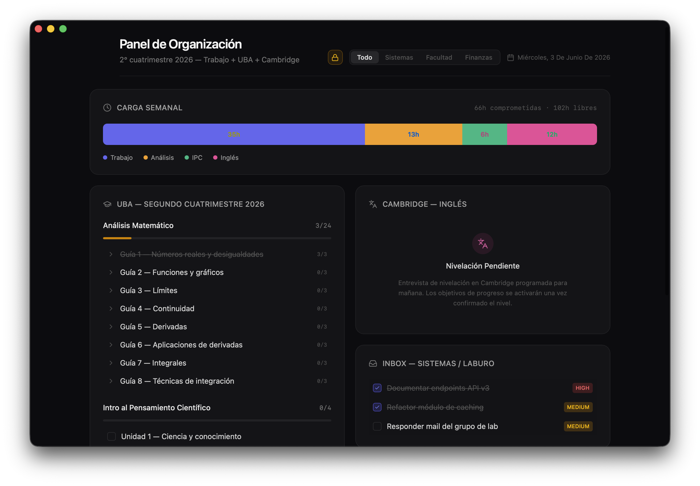
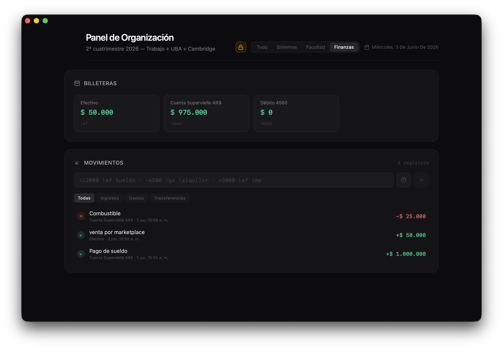

# OrgaLife

[](https://github.com/mgdev02/OrgaLife)

**OrgaLife** es una herramienta de escritorio nativa para organización personal: tareas pendientes, notas diarias, seguimiento académico (UBA + Cambridge), finanzas con consola de comandos, **gestión de alquiler** (contrato, pagos, comprobantes en Drive) y **eventos de Google Calendar** en el dashboard. Los datos se guardan en **localStorage** y se sincronizan con **Google Drive** (carpeta oculta `appDataFolder`) cuando iniciás sesión con Google.

**Atajo global (macOS):** `⌘ Command` + `⌥ Option` + `O` — muestra u oculta la ventana. El botón rojo de cerrar oculta la ventana; la app sigue en el Dock.

**Stack:** [React 19](https://react.dev/) + [TypeScript](https://www.typescriptlang.org/) · [Tailwind CSS v4](https://tailwindcss.com/) · [Vite 8](https://vite.dev/) · [Tauri v2](https://v2.tauri.app/) (Rust).

**macOS:** el build de producción usa compilación **unsigned** local (`TAURI_SKIP_SIGNING=true`). Para distribución pública firmada, configurá firma de código por separado.

## Vista previa

<p align="center">
  
</p>

<p align="center">
  
</p>

## Requisitos

- Node.js 20+
- [Rust](https://www.rust-lang.org/tools/install)
- macOS: Xcode Command Line Tools (`xcode-select --install`)
- Cuenta de [Google Cloud](https://console.cloud.google.com/) (gratis para uso personal / testing)

## Configuración de Google Cloud (OAuth + Drive)

Necesitás esto **una vez** para que funcionen el login con Google y la sincronización en Drive. **No subas credenciales a GitHub.**

### 1. Proyecto y APIs

1. Entrá a [Google Cloud Console](https://console.cloud.google.com/).
2. Creá un proyecto (ej. `OrgaLife Desktop`) o elegí uno existente.
3. **APIs y servicios → Biblioteca** — habilitá:
   - **Google Drive API**
   - **Google Calendar API** (eventos del día en el dashboard)
4. El perfil de usuario sale del scope `openid email profile` (no hace falta People API).

### 2. Pantalla de consentimiento OAuth

1. **APIs y servicios → Pantalla de consentimiento de OAuth**.
2. Tipo de usuario: **Externo** (para tu cuenta; en testing alcanza).
3. Completá lo mínimo:
   - **Nombre de la aplicación:** OrgaLife
   - **Correo de asistencia al usuario** y **Correo del desarrollador**
4. **App domain / Homepage / Privacy / Terms:** podés dejarlos vacíos para una app de escritorio en modo prueba.
5. En **Scopes**, agregá (o verificá que el login los pida):
   - `openid`
   - `email`
   - `profile`
   - `https://www.googleapis.com/auth/drive.appdata` (sync en carpeta oculta de Drive, no en “Mi unidad”)
   - `https://www.googleapis.com/auth/calendar.events.readonly` (solo lectura de eventos)
6. En **Usuarios de prueba**, agregá cada cuenta de Google que vaya a usar la app (en modo *Testing* solo esas cuentas pueden iniciar sesión). Para cualquier `@gmail.com` hay que **publicar** la pantalla de consentimiento en Google Cloud.

### 3. Credenciales OAuth (aplicación de escritorio)

1. **APIs y servicios → Credenciales → Crear credenciales → ID de cliente de OAuth**.
2. Tipo de aplicación: **Aplicación de escritorio**.
3. Nombre: ej. `OrgaLife macOS`.
4. Copiá el **ID de cliente** y el **Secreto del cliente**.

El flujo de login usa **OAuth2 con PKCE** y un servidor **loopback** en `127.0.0.1` (puerto aleatorio). No hace falta configurar redirect URIs manualmente en la consola para el tipo “Escritorio”.

### 4. Credenciales en el proyecto (local, sin commitear)

El repo incluye una plantilla; el archivo con valores reales **está en `.gitignore`**:

```bash
cp src-tauri/src/auth/credentials.example.rs src-tauri/src/auth/credentials.rs
```

Editá `src-tauri/src/auth/credentials.rs` y reemplazá:

```rust
pub const GOOGLE_CLIENT_ID: &str = "TU_CLIENT_ID.apps.googleusercontent.com";
pub const GOOGLE_CLIENT_SECRET: &str = "TU_CLIENT_SECRET";
```

por los valores de la consola. **Nunca** hagas `git add` de `credentials.rs`.

| Archivo | En GitHub |
|---------|-----------|
| `credentials.example.rs` | Sí (plantilla) |
| `credentials.rs` | **No** (solo en tu máquina) |

### 5. Tokens en el sistema

Tras el login, los tokens se guardan en el **llavero del SO** (macOS Keychain, etc.) vía la crate `keyring`, no en el repo.

### 6. Datos en Drive

La app guarda un JSON (`orgalife_state.json`) en la carpeta oculta **appDataFolder** de Drive (no aparece en “Mi unidad” como archivo normal). La sincronización es automática con debounce; el estado se ve en el subheader (Sincronizado / Pendiente / Sin conexión, etc.). Los comprobantes de alquiler (PDF/imagen) se suben aparte a Drive vía la API de adjuntos.

### 7. Modo bloqueo (ejecución)

El candado del header activa **modo ejecución**: la mayoría de paneles queda en solo lectura, pero **Tareas pendientes** sigue operativa (marcar, prioridad, agregar); solo se oculta el botón de eliminar.

---

### Si expusiste credenciales por error

Si alguna vez commiteaste `credentials.rs` o pegaste el Client Secret en un issue:

1. En Google Cloud → **Credenciales**, **revocá** el secreto y creá uno nuevo (o borrá y recreá el cliente OAuth).
2. Quitá el archivo del historial de Git si ya hiciste push (`git rm --cached`, y considerá rotar con `git filter-repo` o soporte de GitHub para secretos).
3. Volvé a copiar solo en `credentials.rs` local.

---

## Desarrollo

```bash
npm install

# Credenciales Google (si aún no lo hiciste)
cp src-tauri/src/auth/credentials.example.rs src-tauri/src/auth/credentials.rs
# editar credentials.rs con tu Client ID y Secret

npm run tauri:dev
```

Levanta Vite en `http://localhost:5173` y abre la ventana nativa de Tauri.

Solo frontend en el navegador (sin login ni sync de Drive):

```bash
npm run dev
```

## Compilación para producción (macOS)

```bash
npm run tauri:build
```

Usa `TAURI_SKIP_SIGNING=true` cuando no hay certificado de Apple.

### Artefactos generados

| Tipo | Ruta |
|------|------|
| App bundle | `src-tauri/target/release/bundle/macos/OrgaLife.app` |
| Instalador DMG | `src-tauri/target/release/bundle/dmg/` |

Estas rutas están en `.gitignore` y **no deben subirse** a GitHub.

## Publicar en GitHub de forma segura

Antes del primer `git push`:

```bash
npm run preflight
```

El script comprueba que no haya `.env`, claves de firma, `credentials.rs` en el índice, Client ID/Secret de Google en archivos versionados, ni `src-tauri/target/` listo para commitearse.

**Checklist rápido**

- [ ] `credentials.rs` existe solo localmente (copiado desde `credentials.example.rs`)
- [ ] `git status` no muestra `credentials.rs`
- [ ] No hay `GOCSPX-...` ni Client ID real en archivos que vayas a commitear
- [ ] Usuario de prueba agregado en la pantalla de consentimiento (modo Testing)

**Limpieza opcional en disco**

```bash
rm -rf src-tauri/target dist node_modules
npm install
```

**Inicializar repo** (si aún no existe)

```bash
git init
git add .
git status    # confirmá que NO aparecen credentials.rs, target/, node_modules/, dist/
git commit -m "Initial public release: OrgaLife (Tauri v2)"
git remote add origin https://github.com/mgdev02/OrgaLife.git
git push -u origin main
```

## Scripts npm

| Script | Descripción |
|--------|-------------|
| `npm run dev` | Vite dev server (web) |
| `npm run build` | Typecheck + build estático en `dist/` |
| `npm run tauri:dev` | App de escritorio en desarrollo |
| `npm run tauri:build` | Empaquetado Tauri para producción (sin firma) |
| `npm run preflight` | Verificación previa a publicar en GitHub |
| `npm run lint` | ESLint |

## Licencia

Este proyecto está bajo la Licencia MIT. Ver [LICENSE](LICENSE).
